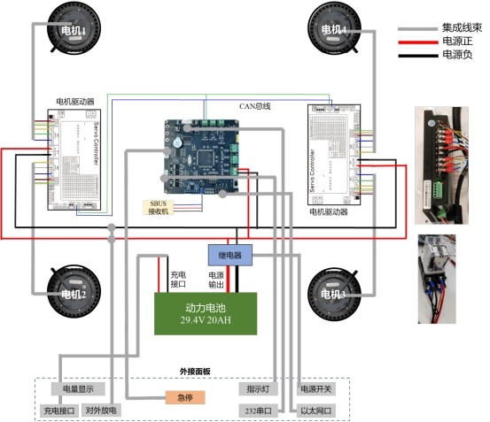
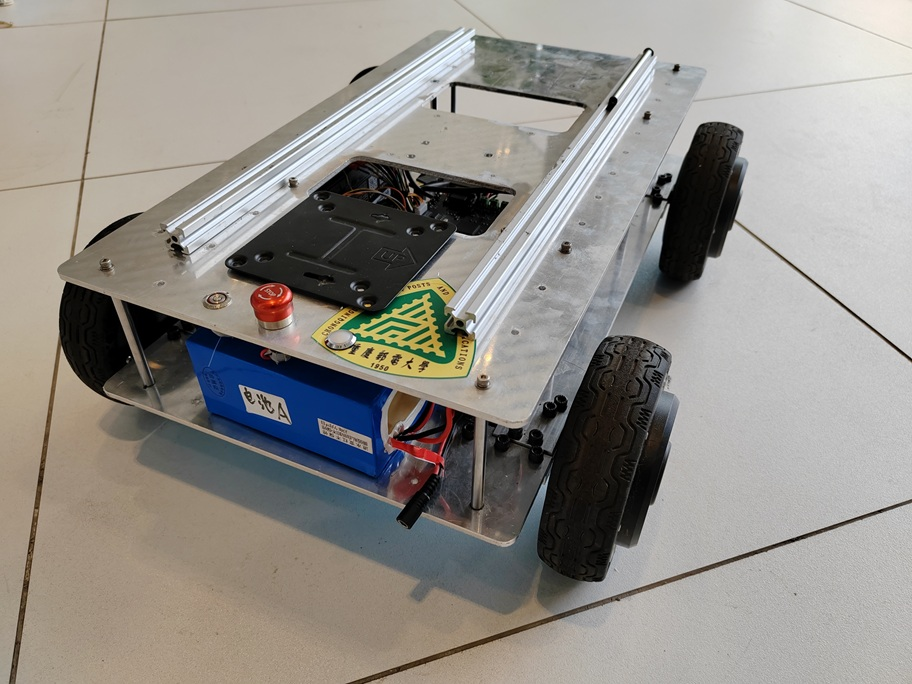
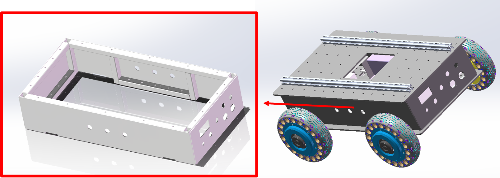

 ## 1、电气系统

小车电气设备清单如表 1 所示。整车动力由 4 台 8 寸轮毂电机提供，配置**2 台一拖二驱动器**，每台驱动器驱动车身同一侧 2 台电机；供电采用 7S 锂电池（标称 25.2V，需配备 BMS 保护板），动力系统支持 24V 输入。模块连接所需连接线、接插件、热缩管等耗材汝表2所示可按需增删。

 
 表1 Mickrobot V3 电气设备清单

| ***类别*** | ***序号*** | **名称**      | ***规格/型号***          | ***数量*** |
| -------------- | -------------- | ----------------- | ---------------------------- | -------------- |
| 电气设备       | 1              | 轮毂电机          | WS80L-07A250C | 4              |
|                | 2              | 电机驱动器        | L2DB4830                     | 2              |
|                | 3              | 电池              | 磷酸铁锂电池  29.4V20AH      | 1              |
|                | 4              | 控制板（VCU）     | 定制 STM32F407-IN873         | 1              |
|                | 5              | 电源板            | 定制  19V-3A  /12V-2A /5V-2A | 1              |
|                | 6              | 遥控器            | 航模遥控器T8FB 控+R8FM       | 1              |
|                | 7              | USB转232串口线    | 绿联                         | 1              |
|                | 8              | 7.2V锂电池充电器  | 与遥控器配套购买             | 1              |
|                | 9              | 29.4V锂电池充电器 | 与电池配套购买               | 1              |

 
 表2 Mickrobot V3 电气设备连接所需耗材

|      ***类别***       | ***序号*** | **名称**                 | ***规格/型号***                                        | ***数量*** |
| :-------------------: | ---------- | ------------------------ | ------------------------------------------------------ | ---------- |
| 电气设备-连线及小模块 | 1          | 电量显示单元             | 7串充饱29.4V三元锂电                                   | 1          |
|                       | 2          | 充电延长线5521           | 线长50CM、插座 5.5X2.1、金属插头 5.5X2.1、18AWG（10A） | 1          |
|                       | 3          | 航空插头2p Gx16          | 供电线和外接线  切线长度90cm，在尾部10cm左右串联保险丝 | 1          |
|                       | 4          | 急停开关                 | 16mm金属急停2开2闭                                     | 1          |
|                       | 5          | 电源开关                 | 16mm自锁按键标志：环形+电源标                          | 1          |
|                       | 6          | 工业指示灯线束/三色LED灯 |                                                        | 1          |
|                       | 7          | D型 232面板              |                                                        | 1          |
|                       | 8          | 232延长线                |                                                        | 1          |
|                       | 9          | D型 typec调试口          |                                                        | 1          |

 

如图 1 所示为本车电气连接示意图。整车由 29.4V/20AH 动力电池供电，经继电器完成动力电源控制；左右各布置一台一拖二电机驱动器，分别驱动同侧两台轮毂电机，驱动器通过 CAN 总线与主控板连接；主控板连接持 SBUS 遥控接收机接入。外接面板集成急停、电源开关、电量显示、充放电接口、指示灯、232 串口、以太网口，实现对外交互与调试。图中灰色为集成线束，红色为电源正极，黑色为电源负极。

 

 

 
图1 小车电气系统连接框图

## 2 机械结构

由于模型文件过大，有需要可以从百度网盘中找到step文件进行加工。

MickRobotV3小车3D模型文件 链接: https://pan.baidu.com/s/1Tm8cC3vw8Vl4whnVbb_SAA?pwd=bcp2 提取码: bcp2 

早期小车使用了上下2块铝板进行支撑(mick_robot_chassis/3D_Model/mickrobotV3-20240628.STEP)，如图2所示，电机通过电机固定支架，固定到下底板，上下底板之间采用的是光轴螺柱进行支撑。该方案结构简单，不需要设计过多的加工流程，如果只是想简单的复现小车的作为平台使用，可以采用该方案。

 

若想采用更为美观的外壳，可自行加工一个边框(mick_robot_chassis/3D_Model/中间框-焊接20-20250503.STEP)放置于上下底板之间替代光轴螺柱，如图3所示。

 

带外壳的小车模型文件名称为“装配体2-mickx4-8寸轮胎-外壳-v3-2.stl” 和 装配体2-mickx4-8寸轮胎-外壳-v3-4.STEP
