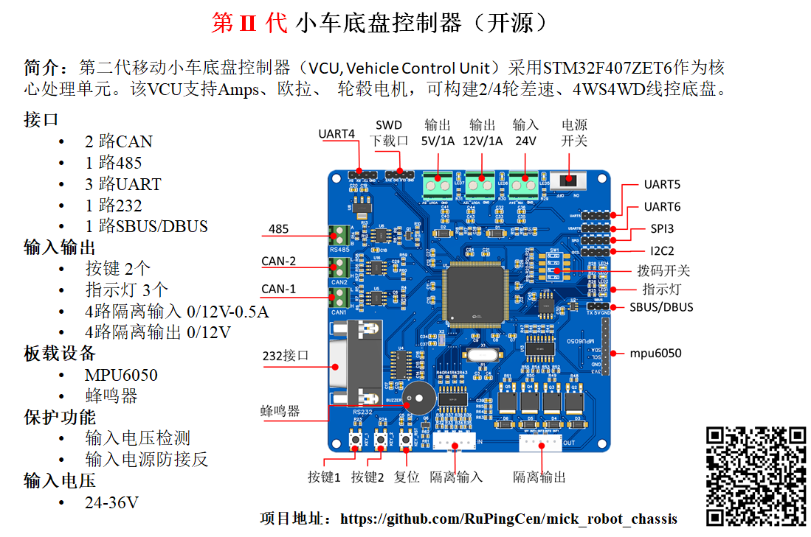
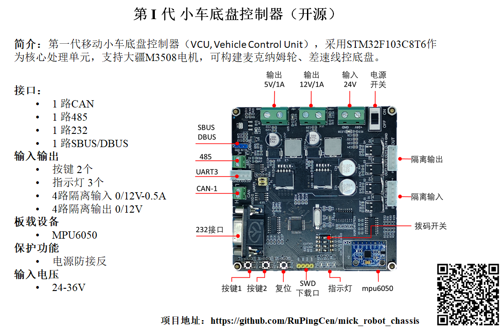

# 控制板、电源板

## 1 小车控制板

## 1.1 小车控制板V3

第三版小车控制板采用了STM32F407作为主控制器

### 1.2 小车控制板V1

第一版控制板采用STM32F103作为主控制芯片。控制板输入20-36V DC直流，对外提供1路DC 5V 2A 、1路DC 12V 2A 对车载传感器供电。

提供1路DBUS接口、1路232接口、1路CAN总线、1路485接口、1路UART3接口（与485复用）、1路IIC。其中DBUS被用来接收遥航模遥控器的数据，232接口负责与上位机ROS通讯。CAN总线连接4个M3508电机。IIC连接板子上安装的MPU9250。485接口和UART3接口复用，可扩展其他传感器模块。
3路LED指示灯用于显示程序状态。2路按键、4路拨码开关用于调试和选择程序功能。4路隔离输入（输入电压范围12-24V）。4路隔离输出（输出高阻态和GND，承受电流2A）。

### 1.2 小车控制板外形尺寸

第1版和第3版的小车控制板外形和安装孔位一致。

板子外形为99*99 mm 安装孔位于四周呈轴对称分布，孔中心间距为93mm,孔直径为φ3.1 mm。如下图所示。
 

## 2 小车电源板
如下图所示，设计如下电源板以满足对工控机和自主导航小车车载传感器供电需求。

- 输入20-36V DC直流，
- 输出1路DC 5V 2A 
- 输出1路DC 3.3-19V 2A 可调电源 
- 输出1路DC 12V 3.5A
- 输出1路DC 19V 3.5A
  

