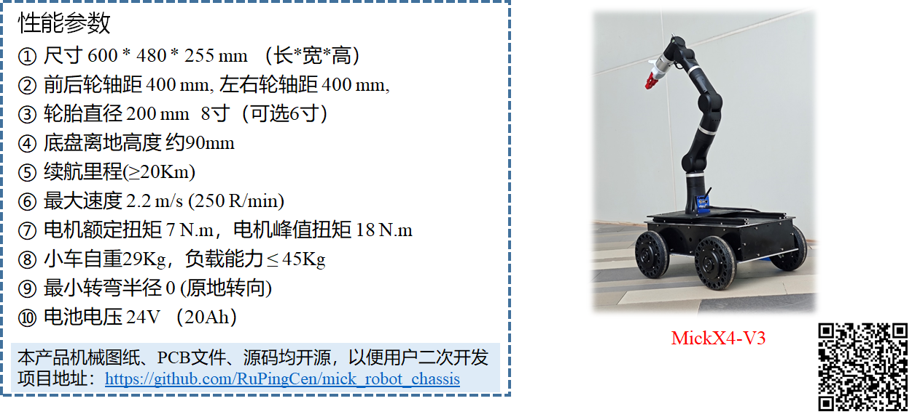
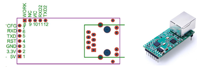
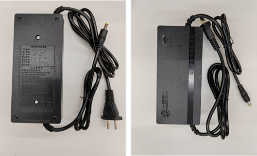
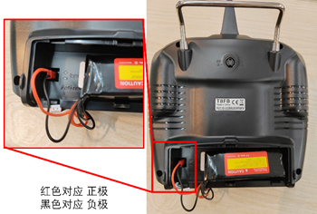
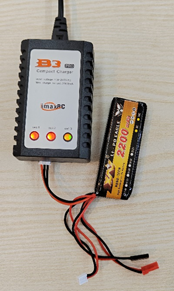

# mick_robot_chasiss

项目文档：https://mickrobot.github.io/ 

本项目描述了针对室外环境设计的一个开源ROS小车底盘，项目开源了小车的3D机械图，基于STM32设计的小车控制板，电源板（为传感器供电）；小车的**PCB**、**代码**及**3D图纸**均是开源，大家可以自行下载打样学习。

------------------------------------------------------------------------------------------

注意：开源的电源板和控制板仅供大家自己打样学习用，切勿用于商业用途。问题、项目合作可联系 cenruping@vip.qq.com，可以代为调试、新开发线控底盘或针对已有的小车底盘设计**工业版控制器**及**大功率电源模块**。也欢迎加QQ群讨论交流  1149897304 (开源ROS自主导航小车)；

- 小功率电源板-[淘宝链接](https://item.taobao.com/item.htm?spm=2013.1.w4023-18698948782.10.3cd752e6AWcwLT&id=702856225631)
- 大功率电源模块-[淘宝链接](https://item.taobao.com/item.htm?spm=a213gs.success.result.1.5ac34831gMQFX4&id=746778756080)
- 控制板-V1-[淘宝链接](https://item.taobao.com/item.htm?spm=2013.1.w4023-18698948782.7.5ec21803wgmf68&id=649231129557)

------------------------------------------------------------------------------------------

**代码说明**
- **master分支 为第3版小车 MickX4-V3（ 最新版）**，

- MickX4-V2分支为第2版小车代码分支。 

- M4分支为麦克纳姆轮第一版小车代码分支。[项目更新日志](https://github.com/RuPingCen/mick_robot_chasiss/tree/master/更新日志.md)

**文件目录说明**

- **ROS_Node**：小车底盘配套的ROS节点，其功能为对外发布小车里程计数据，接收ros cmd_vel话题控制命令控制小车移动
- **STM32_Code**：存放小车上嵌入式控制板的代码文件，控制器采用STM32F407
- **3D_Model_xxx**：存放小车3D模型文件
- **PCB_File**：存放小车上所用PCB文件
- **Reference_Documents**：存放相关的传感器的使用手册等
## 1 简介
<div align=center>

</div>
 


## 2 小车使用说明
master分支代码文件可适配**两轮**、**四轮差速小车**。两轮差速底盘，需要把底盘电机ID设置为1和3即可使用4轮差速底盘相同的命令。

###  2.1 面板说明

下图所示，小车车尾面板第一排接口从左到右依次为电量显示模块、急停按钮、三色指示灯、电源按钮，面板第二排接口从左到右依次为电池充电口、外部供电接口（24V/10A）、232串口、以太网调试口。面板对外提供24V/10A的电源用作传感器供电，采用GX16-2芯航空插头（**1号引脚为+VCC，2号引脚为GND** 注意面板放电口输出电压为22.4-29.4V）。

<div align=center>

</div>

**（1）小车状态指示灯**

小车面板状态指示灯正常情况为绿灯闪烁，部分异常情况如下：

1、若呈现绿灯闪烁同时红灯常亮则代表急停按钮未松开；

2、若在开机的时候出现黄色灯单独快闪则代表小车未收到遥控器信号；

3、若在小车开机时刻出现红灯慢闪4次则表示控制板传感器故障（IMU未初始化）。


**（2）以太网调试口**

小车面板上以太网调试口IP地址固定为“192.168.0.7”，将网线连接面板调试口与电脑，配置电脑IP地址为“192.168.0.201”。利用github仓库目录下“Reference_Documents/02_调试工具/网络_串口调试工具.exe”工具，将调试工具默认端口设置为8234，串口波特率为256000，工作模式设置为TCP服务端，即可打印小车调试信息。

小车内部是通过外接串口转以太网模块实现以太网通讯的。再对小车维修时，若设置模块后忘记参数及IP地址。可打开小车外壳，找到如下图所示的串口转以太网模块，通过短接GND与模块上的复位引脚RST(引脚编号为4)进行复位（短接时间≥200ms），网络复位以后网络模块ip默认为192.168.0.7，通讯波特率为115200。模块引脚如下图所示。

<div align=center>

</div>


**（3）小车底盘充电**

对小车电池充电请使用配套的充电器进行充电！充电时将充电器圆孔插头插入小车面板充电口，充电器功率约为180W，充电器输出电压为24-29.4V,充电时长约为4-5小时。

<div align=center>

</div>

==注：==[小车固件更新操作说明](https://github.com/RuPingCen/mick_robot_chasiss/tree/master/小车组装说明.md) 


### 2.2 遥控器操作说明

这里使用的是左手油门的RadioLink T8FB遥控器。

1. 遥控器**左上角的拨动开关**为功能选择按键：置于L档，即最上方位置，表示开启自动驾驶（遥控器操作无效），置于H档表示由遥控器控制小车，忽略上位机命令。

2. 遥控器**右上角拨动开关**上中下位置分别对应小车1m/s、2m/s、2.2m/s速度。

3. 左手边摇杆竖直方向通道（ch3）控制小车前后运动（如下图所示），右边的摇杆水平通道控制小车左右旋转。

<div align=center>
   
</div>
   

遥控器电池电压低的时候，会发出 “滴滴~”的声响，此时打开后盖将电池取出。（注意电池插头的正负方向，对应遥控器背后”+“，”—“标识）

<div align=center>

</div>

使用配套充电器充电，电池充满以后充电器的灯由红色变为绿色。遥控器充电时需使用遥控器对应的充电器，遥控器电池为2s电池，电池电压范围（6.4V-8.4V）。

<div align=center>

</div>

### 2.3 启动小车ROS节点

ROS节点与控制板的通讯协议：  https://docs.qq.com/sheet/DV2hmSEdSYVVtclB4 

小车的配套的ROS节点位于 https://github.com/RuPingCen/mick_robot_chasiss/tree/master/ROS_Node 

该**ROS_Node**目录中包含两个文件夹： **mick_bringup**和**mick_description** ，**mick_bringup**为小车对应的ROS驱动节点，**mick_description**为urdf模型。

**step1:** 将ROS_Node中的mick_bringup目标代码拷贝到ROS工作空间进行编译

```shell
cp -r mick_bringup ~/catkin_ws/src
cd ~/catkin_ws/src
catkin_make
```

**step2**： 通过USB转232串口线连接电脑和小车控制板，

修改串口权限（可以查看设备的ID号 ls /dev/ttyUSB*）

```
sudo chmod 766 /dev/ttyUSB0
```

 或者根据串口设备的标识符去设置串口别名

```
cd mick_bringup/scripts
sudo cp ultrasonic.rules /etc/udev/rules.d/
```

把文件拷贝到/etc/udev/rules.d目录下就可以使用 /dev/mick替代 /dev/ttyUSB0 来访问模块了

**step3:** 启动ROS节点

```shell
roslaunch mick_bringup mickrobot_v3.launch
```

小车节点启动以后可以通过rostopic list命令查看到该ROS节点会对外发布如下Topic

<div align=center>

</div>

其中：

- /mickrobot/chassis/Imu     对外发布小车自身IMU测量数据
- /mickrobot/chassis/odom  小车里程计数据
- /mickrobot/chassis/odom/path   小车里程计数据对应的路径（默认不发布）
- /mickrobot/rc_remotes/joy  遥控器数据（默认不发布）
- /mickrobot/chassis/cmd_vel    小车控制命令接收话题


mickrobot_v3 launch文件内容如下：

```xml
<launch>
  <node pkg="mick_bringup" type="mickx4_bringup_v3" name="mickrobot" output="screen">

	  <param name="dev" value="/dev/ttyUSB0" type="str" />
	  <param name="baud" value="115200" type="int" />
	  <param name="time_out" value="1000" type="int" />
	  <param name="hz" value="100" type="int" />

	  <param name="chassis_type" value="0" type="int" /> <!--0: 差速底盘  1: 麦克纳姆轮底盘 2:阿卡曼转向  3全向-->

	  <param name="sub_cmdvel_topic" value="chassis/cmd_vel" type="str" />
	  <param name="pub_odom_topic" value="chassis/odom" type="str" />
	  <param name="pub_imu_topic" value="chassis/Imu" type="str" />
	  
	  <param name="is_pub_path" value="1" type="int" /> <!--0: 不发布底盘轨迹  1: 发布 -->
	</node>
</launch>
```

**step4**: 新建终端，通过ROS话题向  **/mickrobot/chassis/cmd_vel** 话题发布数据 控制小车移动（**注意 将遥控器左上角拨码开关拨到最上，表示开启自动驾驶模式**）

```shell
rostopic pub /mickrobot/chassis/cmd_vel -r 10 geometry_msgs/Twist "linear:
  x: 0.0
  y: 0.0
  z: 0.0
angular:
  x: 0.0
  y: 0.0
  z: -0.1" 
```

角速度方向： 逆时针为正，速度方向：车头方向为x方向。


**step5**:  或通过键盘遥控小车底盘（step4和step5选其中一个即可）

这里借助turtlebot3提供的键盘控制节点，检验小车与ROS节点通讯是否正常

注意：需要安装  **sudo apt-get install ros-noetic-turtlebot3-teleop** 包

```shell
export TURTLEBOT3_MODEL=burger
roslaunch turtlebot3_bringup turtlebot3_model.launch
```


